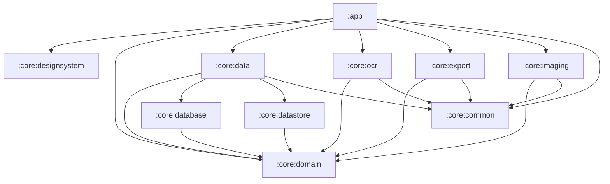

# ScanForge

**Production-grade, on-device OCR + PDF document scanner for Android.**

ScanForge turns your phone camera into a document scanner: detect page edges, correct
perspective, enhance the image, recognise text in multiple scripts, and export a
**searchable** (or encrypted) PDF — all **entirely on-device**. No page, no pixel, and no
recognised character leaves the phone unless you explicitly opt into sync.

[](https://github.com/MobsLInep/ScanForge/actions/workflows/ci.yml)

---

## Table of contents

- [Highlights](#highlights)
- [Tech stack](#tech-stack)
- [Architecture overview](#architecture-overview)
- [Module reference](#module-reference)
- [Privacy model](#privacy-model)
- [Build & run](#build--run)
- [Testing](#testing)
- [Architecture by phase](#architecture-by-phase)
  - [Design System](#design-system)
  - [Phase 1 — Foundation](#phase-1--foundation)
  - [Phase 2 — Scanning / Camera](#phase-2--scanning--camera)
  - [Phase 3 — Image processing / enhancement](#phase-3--image-processing--enhancement)
  - [Phase 4 — OCR](#phase-4--ocr)
  - [Phase 5 — Export / searchable PDF](#phase-5--export--searchable-pdf)
  - [Phase 6 — Document manager](#phase-6--document-manager)
  - [Phase 7 — Settings / backup / sync / onboarding](#phase-7--settings--backup--sync--onboarding)
  - [Phase 8 — Production hardening / launch readiness](#phase-8--production-hardening--launch-readiness)
- [Sample artifacts](#sample-artifacts)
- [Roadmap / known deferrals](#roadmap--known-deferrals)

---

## Highlights

- **Camera scanning** with capture-time edge detection (OpenCV) and a manual corner-crop fallback, plus batch capture and SAF image/PDF import.
- **Non-destructive image editor** — perspective warp, deskew, shadow removal, and Auto / Magic Color / Grayscale / B&W filters, with a live before/after preview.
- **On-device OCR** via ML Kit Text Recognition v2 behind a swappable engine abstraction — Latin, Devanagari (Hindi/Marathi), Chinese, Japanese, Korean.
- **Searchable PDF export** using a hand-rolled, dependency-free, pure-Kotlin PDF writer with an invisible text layer (incl. embedded Devanagari font), RC4-128 password encryption, compression and colour modes — plus plain-text export.
- **Document manager** — folders, tags, favourites, FTS4 full-text search with ranked highlighted snippets, sort/filter, multi-select, and a soft-delete trash with auto-purge.
- **Settings, encrypted backup/restore** (AES-256-GCM, PBKDF2), an opt-in cloud-sync abstraction, and first-launch onboarding.
- **Launch hardening** — R8 + resource shrinking, baseline profile, StrictMode, LeakCanary, adaptive icon + splash, a telemetry seam that is **off by default and no-op**, Hindi localisation scaffold, and CI.

## Tech stack

| Area | Choice |
| --- | --- |
| Language | Kotlin 2.0.21 |
| UI | Jetpack Compose + Material 3, custom design system |
| Architecture | MVVM + Clean Architecture (data / domain / presentation), UDF |
| DI | Hilt 2.52 (KSP) |
| Async | Coroutines + Flow |
| Persistence | Room 2.6.1 + DataStore Preferences |
| Camera | CameraX 1.4.1 |
| Imaging | OpenCV 4.11.0 (Maven Java SDK, no NDK) |
| OCR | ML Kit Text Recognition v2 (bundled, offline) |
| PDF | Hand-rolled pure-Kotlin writer (create) + `PdfRenderer` (preview) |
| Navigation | Compose Navigation, type-safe via kotlinx.serialization |
| Background work | WorkManager (+ Hilt worker factory) |
| Images | Coil |
| Build | AGP 8.7.3, Gradle 8.9, KSP 2.0.21-1.0.28 |
| Testing | JUnit5 (Jupiter), Turbine, MockK, Compose UI test, instrumented JUnit5 (mannodermaus) |
| SDK | `minSdk 26`, `targetSdk 35` |

## Architecture overview

ScanForge is a **multi-module Clean Architecture** app. The domain layer is pure Kotlin/JVM
with **zero Android imports**, which keeps business rules unit-testable on the JVM (no
emulator). Android implementations live in `:core:data` and the feature modules, and the
single `:app` module hosts the Compose presentation layer.



Principles enforced throughout:

- **On-device / privacy first** — nothing leaves the device unless sync is explicitly enabled.
- **Strict layer separation** — `:core:domain` never imports Android.
- **Unidirectional data flow** — sealed UI-state interfaces (`Loading` / `Success` / `Error` / `Empty`).
- **Accessibility** — content descriptions, 48dp targets, dynamic font scaling, TalkBack.
- **All user-facing strings in `strings.xml`** (with a `values-hi` scaffold).
- **Tests alongside each feature** — pure logic on the JVM, Android specifics instrumented.

## Module reference

| Module | Type | Responsibility |
| --- | --- | --- |
| `:app` | Android app | Compose UI, ViewModels, navigation, WorkManager wiring, Application |
| `:core:designsystem` | Android lib | Theme, tokens, `Sf*` components, motion, effect modifiers |
| `:core:common` | JVM | `Result`, `AppError`, dispatcher/scope qualifiers, `StorageGuard` |
| `:core:domain` | JVM | Models, repository interfaces, pure business logic (zero Android) |
| `:core:database` | Android lib | Room entities, DAOs, migrations, schemas |
| `:core:datastore` | Android lib | Typed settings via DataStore Preferences |
| `:core:data` | Android lib | Repository implementations, mappers, DI bindings, Android adapters |
| `:core:imaging` | Android lib | OpenCV pipeline + pure-Kotlin perspective/warp geometry |
| `:core:ocr` | Android lib | ML Kit OCR engine + WorkManager scheduling |
| `:core:export` | Android lib | Pure-Kotlin searchable-PDF writer, encryptor, renderer, export worker |

## Privacy model

The shipped build collects **no data**. Telemetry (crash + analytics) exists only as an
**interface with a no-op implementation** — no Firebase / Play-services SDK is pulled in —
and both flags default **off**. Cloud sync is an abstraction behind an off-by-default flag;
the bundled Google Drive provider is a stub that reports "not configured". See
[`docs/PRIVACY_POLICY.md`](docs/PRIVACY_POLICY.md) and [`docs/DATA_SAFETY.md`](docs/DATA_SAFETY.md).

## Build & run

Prerequisites: JDK 17, Android SDK (platform 35, build-tools 35.0.0). Create
`local.properties` with your `sdk.dir`.

```bash
# Debug build
./gradlew :app:assembleDebug

# Install + launch
adb install -r app/build/outputs/apk/debug/app-debug.apk
adb shell am start -n com.scanforge.app/.MainActivity
```

A debug-only **Design System catalog** ships as a second launcher icon
("ScanForge · Design System", `com.scanforge.app/.catalog.DesignSystemPreviewActivity`).

### Release signing

The release build reads `keystore.properties` (and the referenced `.jks`) from the project
root, and **falls back to debug signing when those are absent** — so CI and fresh checkouts
can `assembleRelease` without secrets. Real keystores and credentials are **git-ignored**;
supply your own upload key before a Play upload (see [`docs/RELEASE_CHECKLIST.md`](docs/RELEASE_CHECKLIST.md)).

```bash
./gradlew :app:assembleRelease   # R8 + resource shrinking
```

## Testing

```bash
# JVM + Android unit tests across all modules
./gradlew :core:common:test :core:domain:test \
  :core:datastore:testDebugUnitTest :core:data:testDebugUnitTest \
  :core:imaging:testDebugUnitTest :core:ocr:testDebugUnitTest \
  :core:export:testDebugUnitTest :app:testDebugUnitTest

# Instrumented tests (emulator/device required)
./gradlew :core:database:connectedDebugAndroidTest :core:ocr:connectedDebugAndroidTest
```

Test strategy: pure logic is tested as **JVM JUnit5** (Jupiter); Android-library unit tests
run JUnit5 via the mannodermaus plugin; DAO and ML Kit tests are **instrumented**. The
heaviest deliverables — perspective/warp math, the searchable-PDF writer, the OCR runner,
search ranking — are deliberately JVM-testable with no emulator.

---

## Architecture by phase

ScanForge was built one phase at a time. Each phase below summarises what was added, the key
architectural decisions, and how it was verified.

### Design System

**Built first, before any feature work.** Establishes the visual language and a reusable
component kit so every later screen composes from the same primitives.

- New module `:core:designsystem` (`com.android.library`); `:app` is a thin host.
- **Brand palette:** amber `#F2A65A` → primary / CTA, teal `#3FB8AF` → secondary / processing,
  slate-indigo `#2D3A5F` → brand / tint. Dark theme by default.
- **Typography:** Space Grotesk / Inter / JetBrains Mono bundled locally as **variable** TTFs
  (OFL) using `FontVariation` — no font library dependency.
- **Extended tokens** (success / warning / scanBeam / brand / hairline / shimmer + mono type)
  exposed through `ScanForgeTheme.colors` / `.mono` / `.motion` via CompositionLocals,
  MaterialTheme-style.
- **10 `Sf*` components** + `ScanForgeMotion` (durations / easings / springs) + effect
  modifiers (`shimmer`, `scanBeamSweep`, `processingPulse`, `hairline`) + `rememberScanForgeHaptics`.
- A debug-only **catalog** (`DesignSystemPreviewScreen` / `DesignSystemPreviewActivity`) ships
  as a second launcher icon.
- Stack pinned here: AGP 8.7.3, Kotlin 2.0.21, Compose BOM 2024.12.01, Gradle 8.9.

### Phase 1 — Foundation

Restructured the project into multi-module Clean Architecture.

- **Modules:** `:core:common` (pure-JVM `Result` / `AppError` / dispatcher + scope
  qualifiers), `:core:domain` (pure-JVM models + repository interfaces, `java.time.Instant`,
  zero Android), `:core:database` (Room entities, DAOs, `Converters`, schema export),
  `:core:datastore` (settings mapping), `:core:data` (mappers, `*RepositoryImpl`, DI).
- **DI:** Hilt end-to-end — `@HiltAndroidApp ScanForgeApplication`, `@AndroidEntryPoint MainActivity`.
- **Type-safe navigation** via kotlinx.serialization — `ScanForgeRoute` sealed graph +
  `composable<T>` / `toRoute<T>`; bottom bar only on top-level destinations.
- **Home** with a sealed `HomeUiState` (Loading / Empty / Success / Error) and a
  `stateIn`/`WhileSubscribed` ViewModel.
- **Test strategy set:** JVM JUnit5 for pure logic; mannodermaus JUnit5 for Android-lib unit
  tests; instrumented JUnit5 for DAOs.
- **Gotcha:** Room `@Relation` does not order rows — page ordering is the mapper's job
  (`PopulatedDocument.toDomain()` sorts by `pageOrder`).

### Phase 2 — Scanning / Camera

The end-to-end capture experience.

- **Decision:** OpenCV via the **Maven Java SDK** (`org.opencv:opencv:4.11.0`, no NDK/JNI),
  `OpenCVLoader.initLocal()` lazily once. Edge detection runs at **capture time** (not per
  frame). Only `CAMERA` is a runtime permission; image/PDF import uses **SAF** (no storage
  permission).
- **Domain:** `DetectedQuad` / `NormalizedPoint`, `EdgeDetector`, `PageImageStore`,
  `PageImporter`, `NewPage`; `DocumentRepository` extended with multi-page create / add /
  delete / reorder.
- **Data:** `OpenCvEdgeDetector` (downscale → gray → blur → Canny → dilate → contours →
  largest convex quad), `AndroidPageImageStore` (UUID JPEGs + 320px thumbnails),
  `AndroidPageImporter` (ContentResolver for images, `PdfRenderer` for PDFs).
- **UI (`ui/scan`):** a `ScanStep` state machine, `LifecycleCameraController` + `PreviewView`
  (tap-to-focus, pinch-zoom, torch), forge-amber capture button with a scan-line sweep,
  grid/quad overlays, a draggable 4-corner crop review (manual fallback), and a batch filmstrip.
- **Tests:** 13 JVM `ScanViewModelTest` cases covering the full state machine + an
  instrumented capture-flow UI test.
- APK grew to ~162MB from OpenCV's `.so` for all ABIs — flagged for later shrinking.

### Phase 3 — Image processing / enhancement

A non-destructive editor that makes scans look professionally processed.

- **New module `:core:imaging`** holding **pure-Kotlin geometry** — `PerspectiveTransform`
  (8×8 Gauss–Jordan homography solve + `map()`) and `QuadGeometry` (output sizing /
  destination corners) — and `OpenCvImagePipeline`, the impl of the new domain `ImagePipeline`.
- **Pipeline:** decode (downscale) → perspective warp → rotate → deskew → filter →
  brightness/contrast → unsharp sharpen → optional denoise → JPEG encode.
- **Filters:** Original, Auto (gray + CLAHE + shadow removal), Magic Color (keeps colour),
  Grayscale, Black & White (adaptive threshold). Shadow removal applies only to gray-based filters.
- **Persistence:** `Page.processing` serialized to a new `processing_params` column; **DB
  v1→v2 + `MIGRATION_1_2`**.
- **UI:** `PageEditorScreen` with a live debounced preview, press-and-hold to compare the
  original, filter chips + sliders + switches; a full-screen `CropEditor` with draggable
  corners, a `Modifier.magnifier` loupe, edge snapping, and an undo stack; a reorderable
  page-card document detail screen.
- **Tests:** the **warp math** (10 geometry tests) runs on the JVM — the headline deliverable.
- **Gotcha:** silent OpenCV failures masked by fallback UI — `findNonZero` returns
  `CV_32SC2`, but `MatOfPoint2f` needs `CV_32FC2` (convert before `minAreaRect`).

### Phase 4 — OCR

On-device text recognition behind a swappable engine, run via WorkManager.

- **New module `:core:ocr`** with ML Kit Text Recognition v2 (bundled, offline) for Latin,
  Devanagari, Chinese, Japanese, Korean.
- **Domain:** a structured `OcrDocument` (fullText + blocks → lines → words tree with
  **normalized** boxes, confidence, recognised languages), `OcrLanguageMode` (Auto / Manual),
  and the `OcrEngine` interface — so a cloud engine can be swapped in later.
- **`MlKitOcrEngine`:** lazily-cached recognizers; **Auto mode** runs Latin + Devanagari and
  keeps the result with the most non-whitespace characters; real per-element confidence.
- **`OcrRunner`** is an **Android-free, JVM-testable** orchestrator; `OcrWorker` is a thin
  Hilt worker that delegates to it. WorkManager is initialised **on-demand** (Application
  implements `Configuration.Provider`; the default initializer is removed in the manifest).
- **Persistence:** `ocr_blocks` JSON column; **DB v2→v3 + `MIGRATION_2_3`**.
- **UI:** an OCR result screen with Image / Text views, a word-box overlay, a low-confidence
  heatmap, inline editing, copy/share, and per-script re-run; auto-OCR on first open when enabled.
- **Tests:** `OcrRunnerTest` with a fake engine (the "fake `OcrEngine`" deliverable) +
  instrumented `MlKitOcrEngineTest` proving real Hindi + English recognition.

### Phase 5 — Export / searchable PDF

Export to searchable / image PDF and plain text.

- **Decision:** a **hand-rolled, dependency-free, pure-Kotlin PDF writer** (not iText, not the
  native `PdfDocument`) — chosen for JVM-unit-testable searchable-text extraction, real
  encryption, and zero dependencies. `PdfRenderer` is still used for in-app preview.
- **New module `:core:export`.**
- **`SearchablePdfWriter`:** PDF 1.7, FlateDecode streams, JPEG `DCTDecode` images embedded
  verbatim, and an **invisible text layer** (`3 Tr` render mode) positioned per word. Latin
  uses WinAnsi Helvetica; non-WinAnsi text uses an embedded **Type0 / Identity-H CIDFontType2**
  font with a `ToUnicode` CMap. A **Noto Sans Devanagari** TTF is bundled so Hindi/Marathi
  text is searchable.
- **`PdfEncryptor`:** standard security handler, **RC4-128 (V2/R3)** with hand-rolled
  RC4/MD5. (`PdfRenderer` cannot open encrypted PDFs, so in-app preview is hidden when a
  password is set.)
- **`ExportRenderer`** streams pages (decode → scale → recycle, OOM-safe), applies colour
  modes via `ColorMatrix`, and writes to the cache dir; `ExportWorker` runs it in WorkManager
  with progress + a foreground notification.
- **Tests:** the searchable layer is verified by inflating the content stream and asserting
  `(word) Tj` + `3 Tr` — no emulator. **External proof:** `pdftotext` extracts English +
  Hindi + Marathi; `pdfinfo` confirms RC4 encryption.
- **Gotcha:** `setForeground` with `FOREGROUND_SERVICE_TYPE_DATA_SYNC` crashes on Android 14+
  unless the app manifest merges a `foregroundServiceType` onto WorkManager's `SystemForegroundService`.

### Phase 6 — Document manager

Turned ScanForge into a real document manager (no new module — extended existing ones).

- **DB v3→v4 + `MIGRATION_3_4`:** `documents` gained `is_favorite`, `folder_id`, `size_bytes`,
  `deleted_at` (soft-delete tombstone); new `folders` table (nestable, plain self-ref ids);
  new **FTS4 `document_fts`** virtual table.
- **Domain (pure, JVM-tested) `library/`:** `DocumentSort`, `DocumentFilter` + `FolderScope`,
  and a `SearchRanker` weighting title > tag > body with per-term-coverage bonuses and
  highlighted single-line snippets. A `selection/` reducer powers multi-select.
- **Data:** an `FtsIndexer` keeps the FTS table in sync on every content change;
  `DocumentRepository` gains `observeLibrary(sort, filter)`, `search()`, favourites, folders,
  duplicate (deep-copy with new image files), trash (`moveToTrash` / `restore` /
  `emptyTrash` / `purgeTrashedBefore`).
- **UI:** a grid/list home with folders, favourites carousel, a contextual multi-select
  toolbar, sort/filter sheets; a ranked **search** screen with amber-highlighted snippets and
  page-jump chips; a **trash** screen with retention and auto-purge; document detail metadata
  + rename / move / duplicate / trash.
- **Gotcha:** Room FTS4 entities use `@PrimaryKey @ColumnInfo(name="rowid")` and are synced
  manually (Room doesn't auto-create sync triggers).

### Phase 7 — Settings / backup / sync / onboarding

Full settings, encrypted backup/restore, an opt-in sync abstraction, and onboarding — **no
new libraries** (backup uses built-in `javax.crypto`).

- **Decisions:** cloud sync = interface + mock + a **stubbed** Google Drive provider behind an
  off-by-default flag (no Drive SDK pulled); app lock = not implemented (opted out).
- **Backup:** `BackupCrypto` (PBKDF2WithHmacSHA256 120k → **AES-256/GCM**), `BackupArchiver`
  (ZIP with a clear `manifest.json` + per-entry encryption), `AndroidBackupManager` (gathers
  the DB + page/thumbnail files over SAF). Restore **stages** files and swaps them in
  `Application.onCreate` *before* Room opens (never overwrites a live SQLite file).
- **Sync:** a pure `SyncEngine` (last-write-wins planning), a fully-mockable
  `CloudSyncProvider`, and a periodic `SyncWorker` (no-op until a provider is configured).
- **Onboarding:** a 5-page pager (value slides + real permission priming + language picker)
  gated on an `onboarding_complete` DataStore flag.
- **Theming:** a runtime `accent` (Amber / Teal) added to the design-system theme.
- **The explicit ask:** the Home top bar "ScanForge" title was wrapping to two lines — fixed
  with a single-line ellipsised title and overflow menu.
- **External proof:** a produced backup ZIP was inspected with `unzip` — `manifest.json` +
  `payload/db/*` + `payload/pages/*` + `payload/thumbnails/*`, round-tripped and verified.

### Phase 8 — Production hardening / launch readiness

Performance, release, robustness, accessibility, and privacy polish for launch.

- **Decisions:** crash + analytics = **interface + no-op stub** (no Firebase / Play-services);
  perf tooling = **R8 + baseline-profile rules + StrictMode + LeakCanary** (no Macrobenchmark
  module); localisation = `values-hi` scaffold (rest fall back to English).
- **Telemetry seam (zero-Android):** `CrashReporter` / `AnalyticsTracker` interfaces with a
  coarse, non-PII event vocabulary; a `NoOpTelemetry` impl that only logs locally **when
  opted in** and never leaves the device. Both flags default **off**, wired through settings.
- **Application wiring:** `installStrictMode()` (debug), `installCrashHandler()` (inert unless
  opted in), and consent observation.
- **Robustness:** a pure `StorageGuard` (fails closed on unknown free space); export checks
  available bytes and surfaces a low-storage banner.
- **Build/release:** `signingConfigs.release` reads `keystore.properties` with a debug-signing
  fallback; release is minified + resource-shrunk with real `proguard-rules.pro` keep rules
  (kotlinx.serialization, persisted enums, OpenCV/ML Kit, the PDF writer); version `1.0.0`.
- **Startup:** a hand-authored **baseline profile** shipped via `profileinstaller`; an adaptive
  **app icon** (vectors only — scanner brackets + forge flame) and a back-ported **splash screen**.
- **Localisation:** `values-hi/strings.xml` (~50 core strings); verified via per-app locale.
- **CI:** `.github/workflows/ci.yml` — lint + all-module unit tests + `assembleDebug` +
  `assembleRelease` on every PR/push (a Roborazzi screenshot job is stubbed for follow-up).
- **Docs:** [`docs/PRIVACY_POLICY.md`](docs/PRIVACY_POLICY.md),
  [`docs/DATA_SAFETY.md`](docs/DATA_SAFETY.md),
  [`docs/RELEASE_CHECKLIST.md`](docs/RELEASE_CHECKLIST.md).
- **Verified:** all-module unit tests green, `assembleDebug`, **signed `assembleRelease` (R8)**
  that **runs** on an emulator (keep rules hold), `apksigner verify`, and screenshots
  (splash, one-line top bar, privacy toggles, Hindi locale, StrictMode logging).

---

## Sample artifacts

[`docs/samples/`](docs/samples) contains two example exports produced by the Phase 5 writer:

- `ScanForge_searchable_sample.pdf` — a searchable PDF whose invisible text layer extracts
  with `pdftotext` (English + Devanagari).
- `ScanForge_encrypted_sample.pdf` — the same content with RC4-128 password encryption.

## Roadmap / known deferrals

- **APK size** — five bundled ML Kit script models + OpenCV `.so` dominate; Play
  dynamic-feature delivery / per-ABI splits are still open.
- **Cloud sync** — the engine + provider seam is wired and tested via a fake, but real Google
  Drive OAuth and per-document payload transfer are not implemented (provider is a stub).
- **Measured baseline profile** + Macrobenchmark module (profile is currently hand-authored).
- **Full Hindi translation** + complete RTL / large-font pass (scaffold proves the plumbing).
- **Play assets** (512 icon / feature graphic / store screenshots) and a hosted privacy-policy URL.
- **Roborazzi goldens** (CI job stubbed off), DOCX export, CJK searchable text layer, and
  huge-PDF streaming export.
- A **real upload key / Play App Signing** is required before public launch (the repo ships
  no keystore).
